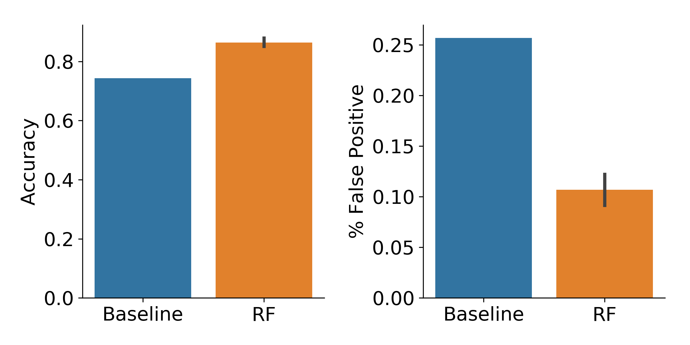

# Bipartite Tracking for Muscle Stem Cells

This repository implements a simple cell tracker based on bipartite graph matching, with some assumptions made that optimize tracking for muscle stem cells.

## Usage

To track cells for a given movie, place binary masks and images in a single directory
and use the `track_well.py` CLI:

```bash
python track_well.py movie_path \
  --img_regex "STRING_TO_GLOB_IMAGES" \
  --mask_regex "STRING_TO_GLOB_MASKS" \
```

See the help menu for further tracking options:

```bash
python track_well.py -h
```
## Quality Control Models

Collecting ground truth information for cell tracks is laborious and expensive. Automated tracking using a bipartite tracker is often highly effective, but still occassionally generates errors. If a user manually provides annotations indicating which tracks are correct, and which contain an error, a machine learning model can be trained to automatically perform this post-processing quality control task.

Here, we provide a tool for training and using tracking QC models in `qc_model.py`. This tool will train either (1) a random forest classifier using hand-engineered features extracted from each track, or (2) a deep recurrent neural network model, which learns features from annotated tracking data.

To use the QC model tool, you will need to train a model:

```bash
python qc_model.py train --config $CONFIG_FILE
```

then call predictions

```bash
python qc_model.py predict --config $CONFIG_FILE --tracks_dir $DIR_TO_PREDICT
```

See the help menu with

```bash
python qc_model.py -h
```

for further details on configuration parameters.

### Performance

We evaluated the performance of random forests as tracking QC models on muscle stem cells. In this context, we find that the model improves reduces the number of tracks with errors (False positive rate) while accurately classifying the majority of tracks.


